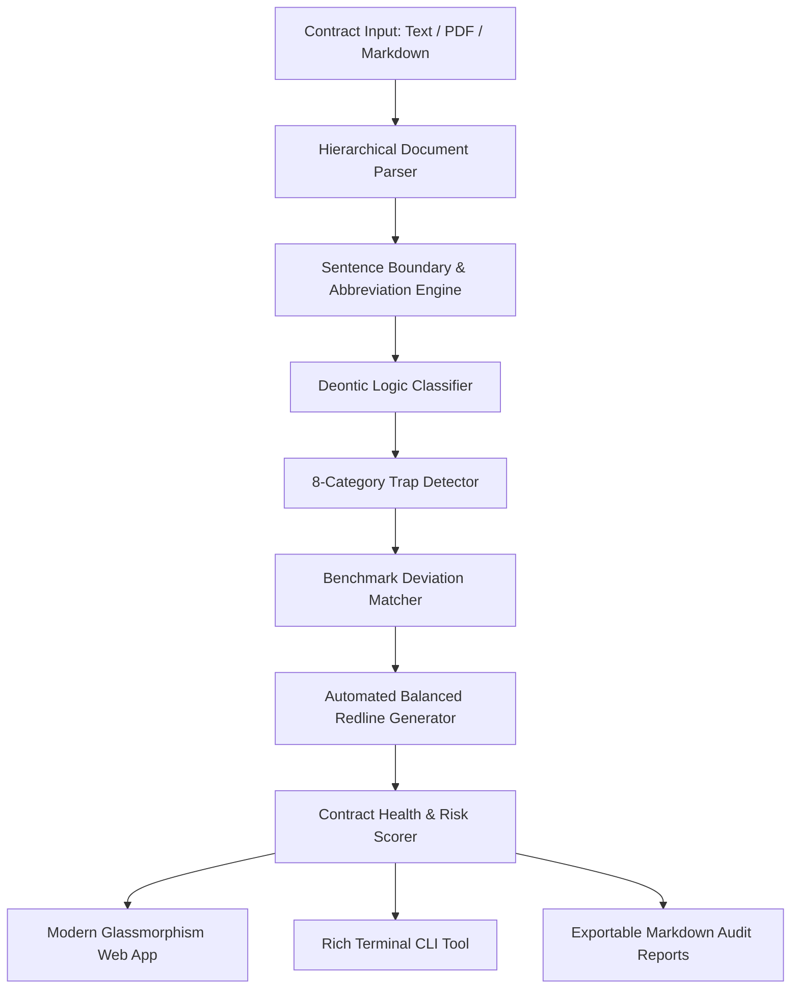

# ⚖️ LexiTrap: Legal Contract Risk & Trap-Clause Auditor
> **Cognitive Legal NLP • Deontic Logic Extraction • Benchmark Deviation Scoring • Automated Redlining**

[](https://lexi-trap.vercel.app/)
[](https://github.com/)
[](LICENSE)
[](https://www.python.org/)

🌐 **Live Web Application**: **[https://lexi-trap.vercel.app/](https://lexi-trap.vercel.app/)**

---

## 📌 1. Project Overview

End-users, developers, and enterprises routinely sign Master Subscription Agreements, Terms of Service (ToS), and NDAs without realizing they contain predatory clauses:
- **Unilateral amendments** (altering fees/terms at will without notice)
- **Perpetual AI model training** on customer proprietary code/data
- **Forced binding arbitration & class action waivers**
- **Asymmetric indemnification** and **$50 total liability caps**

**LexAudit** is an advanced NLP system that parses contracts into hierarchical clauses, classifies deontic normative modalities (*Obligation, Prohibition, Permission, Warranty, Disclaimer*), identifies 8 critical predatory legal traps, measures deviation from gold-standard industry benchmarks (e.g. YC Safe NDA, IEEE SaaS), and generates **automatic balanced redlines** with negotiation talking points.

---

## 🏛️ 2. System Architecture



---

## 🔍 3. The 8 Predatory Trap Taxonomies

| Category | Typical Danger | Recommended Balanced Mitigation |
| :--- | :--- | :--- |
| **1. Unilateral Modification** | Vendor changes pricing/SLA anytime without notice. | 30-day prior written notice + termination with pro-rata refund. |
| **2. Asymmetric Indemnity** | Customer defends vendor against all third-party claims; vendor gives 0 defense. | Mutual IP infringement indemnity capped at 12 months fees. |
| **3. Forced Arbitration & Class Waiver** | Eliminates open court access and jury trial rights. | Multi-tier executive mediation + preserved court jurisdiction. |
| **4. Aggressive IP Expropriation** | Vendor claims perpetual ownership over feedback/workflows. | Customer retains all data/work product; limited operating license. |
| **5. AI Data Harvesting** | Vendor trains commercial LLMs/AI on customer confidential data. | Strict Zero-Data-Retention & No-AI-Training covenant. |
| **6. Trapped Auto-Renewal** | Narrow 90-day certified mail notice; non-refundable lockin. | 30-day proactive reminder + 1-click in-app digital cancellation. |
| **7. Overbroad Non-Compete** | Multi-year worldwide lockout from working in the industry. | Narrowed to 6-month non-solicitation of key personnel (FTC aligned). |
| **8. Zero-Liability Gutting** | Total liability capped at $0 or $50 with "as is" warranty disclaimers. | Balanced 12-month fees paid cap with data breach carve-outs. |

---

## 🚀 4. Quickstart Guide

### Installation
```bash
# Clone repository and enter directory
cd "d:/NLP project"

# Install requirements
pip install -r requirements.txt
```

### Run Automated Tests
```bash
python -m unittest discover -s tests -p "test_*.py"
```

---

## 💻 5. Command-Line Interface (CLI)

Audit any sample contract or custom file directly from the terminal with formatted risk heatmaps:

```bash
# Audit a built-in sample contract
python cli.py --sample predatory_saas_tos

# List all available sample contracts
python cli.py --list-samples

# Audit custom contract file and export markdown report
python cli.py --file path/to/contract.txt --export report.md
```

---

## 🌐 6. Web Application Dashboard & Deployment

* 🚀 **Live Production Deployment**: **[https://lexi-trap.vercel.app/](https://lexi-trap.vercel.app/)**

### Local Run:
```bash
python app.py
```
Open **`http://127.0.0.1:5000`** in your browser.

### Cloud Deployment (Vercel / Render / Railway):
- **Vercel**: Connect the repo on [Vercel.com](https://vercel.com/) — it automatically builds using the included `vercel.json`.
- **Render / Railway / Heroku**: Connect the repo — it builds using `requirements.txt` and `Procfile`.

---

## 🌟 7. Key Features
- **Deterministic Legal NLP**: 100% offline, privacy-preserving, zero third-party API dependencies.
- **Website Action Decision Verdict**: Direct advice on whether it's safe to sign up, log in, or proceed.
- **Linguistic Readability & Obfuscation Analysis**: Flesch Reading Ease and grade-level scoring.
- **Interactive Contract DNA Heatmap**: Visual risk density strip across all contract clauses.
- **Clean Contract Redline Generator**: 1-click generation of balanced, standard-compliant agreements.
- **Draft A vs. Draft B Version Diff Analyzer**: Side-by-side comparative risk reduction auditor.
- **Multi-Format Export**: Print/Save as PDF, Interactive HTML, Markdown, and Plain Text.

---

## 📚 8. Academic Viva & Research Documentation

For detailed theoretical breakdowns, mathematical proofs, deontic modal logic formulation, and 20+ viva interview questions, consult:
👉 **[ACADEMIC_VIVA_GUIDE.md](docs/ACADEMIC_VIVA_GUIDE.md)**
👉 **[REAL_WORLD_TERMS_TRAP_CASES.md](docs/REAL_WORLD_TERMS_TRAP_CASES.md)**

---

## 📄 9. License
MIT License. Built for educational, research, and production LegalTech applications.
