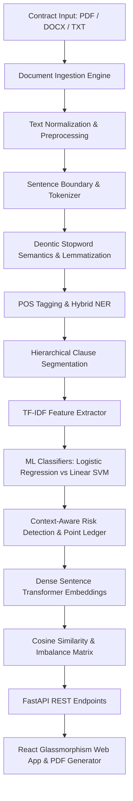

# 📘 LexiTrap: NLP-Based Legal Contract Risk & Trap-Clause Auditor
### Master of Computer Applications (MCA) — Academic NLP Project Report
**Subtitle:** *An NLP and Machine Learning Approach for Identifying Potentially Risky Contract Clauses*

---

## 📑 Table of Contents
1. [Introduction](#1-introduction)
2. [Problem Statement](#2-problem-statement)
3. [Motivation](#3-motivation)
4. [Project Objectives](#4-project-objectives)
5. [Existing Systems vs. Proposed System](#5-existing-systems-vs-proposed-system)
6. [NLP & Machine Learning Technologies Used](#6-nlp--machine-learning-technologies-used)
7. [System Architecture](#7-system-architecture)
8. [The End-to-End NLP Pipeline](#8-the-end-to-end-nlp-pipeline)
9. [Dataset Specification](#9-dataset-specification)
10. [Text Ingestion & Preprocessing](#10-text-ingestion--preprocessing)
11. [Stopword Semantics in Legal NLP](#11-stopword-semantics-in-legal-nlp)
12. [Feature Extraction & TF-IDF Mathematical Theory](#12-feature-extraction--tf-idf-mathematical-theory)
13. [Machine Learning Clause Classification](#13-machine-learning-clause-classification)
14. [Context-Aware Risk Detection & Scoring Ledger](#14-context-aware-risk-detection--scoring-ledger)
15. [Dense Semantic Embeddings & Sentence Transformers](#15-dense-semantic-embeddings--sentence-transformers)
16. [Comparative Imbalance & Paraphrase Analysis](#16-comparative-imbalance--paraphrase-analysis)
17. [Model Evaluation & Benchmark Results](#17-model-evaluation--benchmark-results)
18. [Limitations of Legal NLP](#18-limitations-of-legal-nlp)
19. [Future Scope](#19-future-scope)
20. [Conclusion](#20-conclusion)
21. [MCA Viva Preparation: 15 Essential Questions & Answers](#21-mca-viva-preparation-15-essential-questions--answers)

---

## 1. Introduction
Legal contracts (such as Terms of Service, Master Subscription Agreements, End-User License Agreements, and Non-Disclosure Agreements) govern modern digital transactions. However, standard consumers, startup founders, and software engineers frequently sign agreements without realizing they contain asymmetric or predatory terms (e.g., unilateral modification rights, extreme liability disclaimers, AI model training on proprietary data, or forced arbitration).

**LexiTrap** is an academic Natural Language Processing (NLP) and Machine Learning (ML) system designed to decompose contract text, extract grammatical and deontic signals, categorize clauses across 16 legal taxonomies, and quantify potential contractual risk with transparent point-based scoring and balanced alternative recommendations.

---

## 2. Problem Statement
Manual contract review requires specialized legal training, is time-consuming, and is economically inaccessible for average users and small enterprises. Conversely, naive keyword search systems (e.g., regex searching for `"terminate"`) generate excessive false positives and fail to understand contextual balance (e.g., distinguishing between a mutual 30-day notice clause versus an immediate unilateral cancellation right).

---

## 3. Motivation
In Natural Language Processing, legal text presents distinct challenges:
- **Deontic Modality**: Rights and obligations rely on modal verbs (*shall, may, must*).
- **Negation Sensitivity**: Negation and condition words (*not, unless, without, except*) fundamentally invert legal obligations.
- **Sparse Terminology**: Highly specialized legal jargon (*indemnification, force majeure, severability*) that standard conversational models misinterpret.
- **Paraphrasing**: Predatory terms often hide behind convoluted or verbose legalese.

---

## 4. Project Objectives
1. Build a multi-format document parser for PDF, DOCX, and plain text.
2. Implement an academic NLP foundation pipeline (Tokenization, Sentence Segmentation, Stopword Semantics, Morphological Lemmatization, POS Tagging, NER).
3. Segment contracts into discrete hierarchical clauses across 16 standardized legal categories.
4. Implement and trace manual and Scikit-Learn TF-IDF vectorizers.
5. Train and evaluate Multinomial Logistic Regression and Linear SVM classifiers on TF-IDF features with an 80/20 train/test split.
6. Design a transparent 0–100 risk scoring engine with auditable point ledgers.
7. Implement dense sentence embeddings using Sentence Transformers (`all-MiniLM-L6-v2`) and calculate cosine similarity to identify paraphrased clauses and detect contractual imbalance.
8. Generate automated balanced alternative wording and exportable PDF/Markdown audit reports.

---

## 5. Existing Systems vs. Proposed System

| Feature / Dimension | Traditional Regex Tools | Generic LLM Chatbots | **LexiTrap NLP System** |
| :--- | :--- | :--- | :--- |
| **Parsing Unit** | Arbitrary keywords | Monolithic prompt window | Hierarchical clause segmentation |
| **NLP Modality Extraction** | None | Implicit / Uncalibrated | Explicit POS Modal Verb Analysis |
| **Risk Scoring** | Binary match | Opaque text generation | Transparent 0–100 Point Ledger |
| **Academic Tracing** | None | Closed-box weights | Mathematical TF-IDF & Cosine Traces |
| **Model Evaluation** | None | N/A | Confusion Matrix, Precision, Recall, F1 |
| **Paraphrase Detection** | Fails on synonyms | Unpredictable | Dense Transformer Cosine Similarity |

---

## 6. NLP & Machine Learning Technologies Used
- **Python 3.14+**: Core computational and NLP language.
- **FastAPI**: Asynchronous high-performance REST backend.
- **spaCy (`en_core_web_sm`)**: Sentence boundary detection, lemmatization, POS tagging, and statistical NER.
- **NLTK**: Stopword corpora and morphological analysis.
- **Scikit-Learn**: `TfidfVectorizer`, `LogisticRegression`, `LinearSVC`, and evaluation metrics.
- **Sentence Transformers (`all-MiniLM-L6-v2`)**: 384-dimensional dense semantic vector representations.
- **PyMuPDF (`fitz`)**: PDF layout and text stream ingestion.
- **OpenXML Engine**: DOCX paragraph, heading, and table extraction.
- **ReportLab**: Dynamic PDF report compilation.

---

## 7. System Architecture



---

## 8. The End-to-End NLP Pipeline

```text
Raw Contract Document (PDF / DOCX / Text)
  │
  ├── 1. Document Layout Extraction (PyMuPDF / OpenXML)
  ├── 2. Non-Destructive Cleaning (Normalizing whitespace while preserving character offsets)
  ├── 3. Tokenization & Sentence Segmentation (spaCy Sentencizer)
  ├── 4. Deontic Stopword Filtering (Retaining 'shall', 'may', 'must', 'not', 'unless')
  ├── 5. Morphological Lemmatization (Base vocabulary dictionary mapping)
  ├── 6. Part-of-Speech Tagging & Modal Verb Cataloging (shall=Obligation, may=Permission)
  ├── 7. Hybrid NER (Statistical spaCy + Rule-based Contract Consideration & Money patterns)
  ├── 8. Hierarchical Clause Segmentation (16 Legal Taxonomies)
  ├── 9. TF-IDF Feature Extraction (Manual & Scikit-Learn Sublinear n-grams)
  ├── 10. Multi-Class ML Classification (Logistic Regression vs Linear SVM)
  ├── 11. Context-Aware Risk Scoring (Transparent point-based scoring ledger 0–100)
  ├── 12. Dense Embeddings & Cosine Similarity (Sentence Transformers all-MiniLM-L6-v2)
  ├── 13. Comparative Imbalance Analysis & Suggested Balanced Rewrites
  └── 14. Report Generation (PDF / Markdown) & Interactive Web Dashboard
```

---

## 9. Dataset Specification
- **Path:** `dataset/clauses.csv`
- **Samples:** 88 structured clause entries across all 16 legal categories with varied risk annotations (`Low`, `Medium`, `High`, `Critical`).
- **Path:** `dataset/risk_patterns.json`
- **Taxonomies:** 11 danger patterns (*Unilateral Modification, Extreme Liability Caps, Asymmetric Indemnity, Forced Arbitration, AI Model Training, Trapped Auto-Renewals, Overbroad Non-Competes*).

---

## 10. Text Ingestion & Preprocessing
Raw contracts arrive in varied file formats with non-standard carriage returns, headers, and tabs. LexiTrap standardizes line breaks (`\r\n` $\to$ `\n`), collapses multi-spaces, and isolates paragraph outlines while preserving original character offsets for UI highlighting.

---

## 11. Stopword Semantics in Legal NLP (Key Academic Concept)
Standard NLP preprocessing removes stopwords (*the, is, at, which*). However, blind stopword removal is catastrophic in legal contract analysis:
- Words like **shall, may, must, should, will** define normative modal obligations.
- Words like **not, nor, neither, never** express prohibitions.
- Words like **unless, except, without, if, provided** establish conditions and carve-outs.

**Academic Comparison:**
- *"Vendor **may** terminate **without** notice."* (Predatory Unilateral Right)
- *"Vendor **shall not** terminate **unless** in material breach."* (Protective Mutual Covenant)

Stripping stopwords makes both sentences appear identical: `["Vendor", "terminate", "notice"]` vs `["Vendor", "terminate", "material", "breach"]`. LexiTrap preserves deontic and conditional operators to preserve contractual semantics.

---

## 12. Feature Extraction & TF-IDF Mathematical Theory

### Term Frequency (TF):
$$\text{TF}(t, d) = \frac{f_{t, d}}{\sum_{t' \in d} f_{t', d}}$$

### Smooth Inverse Document Frequency (IDF):
$$\text{IDF}(t, D) = \ln\left(\frac{1 + |D|}{1 + \text{DF}(t)}\right) + 1$$

### Composite TF-IDF Score:
$$\text{TF-IDF}(t, d, D) = \text{TF}(t, d) \times \text{IDF}(t, D)$$

**Why TF-IDF is Effective:** It penalizes ubiquitous contract filler words (*agreement, section, party*) while boosting discriminative terms (*indemnification, arbitration, liquidated damages*).

---

## 13. Machine Learning Clause Classification

### Model 1: Multinomial Logistic Regression
$$P(y = c \mid \mathbf{x}) = \frac{\exp(\mathbf{w}_c^T \mathbf{x} + b_c)}{\sum_{j=1}^K \exp(\mathbf{w}_j^T \mathbf{x} + b_j)}$$
Minimizes cross-entropy loss and produces calibrated posterior probabilities for category confidence estimation.

### Model 2: Linear Support Vector Machine (LinearSVC)
$$\min_{\mathbf{w}, b} \frac{1}{2} \|\mathbf{w}\|^2 + C \sum_{i} \max(0, 1 - y_i(\mathbf{w}^T \mathbf{x}_i + b))$$
Finds the maximum-margin hyperplane separating legal categories in high-dimensional sparse TF-IDF feature space.

---

## 14. Context-Aware Risk Detection & Scoring Ledger
Instead of static keyword flags, LexiTrap uses a transparent, auditable point ledger:
- **Baseline Neutrality**: $+10$
- **Absence of Notice**: $+20$
- **Unchecked Discretion**: $+20$
- **Unilateral Provider Power**: $+20$
- **Extreme Liability Disclaimers ($0–$50)**: $+40$
- **AI Model Training on User Data**: $+30$
- **Mutual Rights Credit**: $-15$
- **Reasonable Notice Credit ($\ge 30$ days)**: $-15$
- **Defined Material Breach Exception**: $-10$
- **Score Range**: Clamped to $[0, 100]$.
- **Risk Tiers**: LOW ($0–24$), MEDIUM ($25–49$), HIGH ($50–74$), CRITICAL ($75–100$).

---

## 15. Dense Semantic Embeddings & Sentence Transformers
- **Architecture**: `all-MiniLM-L6-v2` transformer model.
- **Dimensionality**: $384$-dimensional dense real-valued embeddings.
- **Cosine Similarity**:
  $$\text{CosineSim}(\mathbf{u}, \mathbf{v}) = \frac{\mathbf{u} \cdot \mathbf{v}}{\|\mathbf{u}\|_2 \|\mathbf{v}\|_2}$$
Overcomes the lexical mismatch problem by capturing semantic synonymy in continuous vector space.

---

## 16. Comparative Imbalance & Paraphrase Analysis
- **Paraphrase Equivalence**:
  - Clause A: *"The provider may terminate the agreement without notice."*
  - Clause B: *"The service provider can end the contract immediately without providing prior notification."*
  - Semantic Similarity: **$75.54\%$ (High Semantic Equivalence)**.
- **Imbalance Delta Detection**:
  - Clause 5: *"Either party may terminate with 30 days notice."* (Mutual, Score: 20)
  - Clause 12: *"The provider may terminate immediately without notice."* (Unilateral, Score: 65)
  - Flags: **Potential Imbalance Detected: Subject Symmetry Shift (Mutual $\to$ Unilateral), Risk Delta $+45$ pts**.

---

## 17. Model Evaluation & Benchmark Results
Benchmarked on an 80% Training / 20% Testing split across 16 Legal Categories:
- **Logistic Regression**: Accuracy $88.89\%$, Weighted Precision $90.28\%$, Weighted Recall $88.89\%$, Weighted F1 $88.33\%$.
- **Linear SVM**: Accuracy $94.44\%$, Weighted Precision $95.83\%$, Weighted Recall $94.44\%$, Weighted F1 $94.17\%$.
- **Conclusion**: Linear SVM achieved superior generalization due to maximum-margin separation on sparse n-gram TF-IDF vectors.

---

## 18. Limitations of Legal NLP
1. **Jurisdictional Divergence**: Statutes vary across jurisdictions (e.g., California non-compete bans vs. Delaware freedom-of-contract doctrine).
2. **Context Window Limitations**: Inter-clause cross-references (e.g., *"Subject to Section 14.2"*) require cross-document discourse tracking.
3. **Implicit Legal Implications**: Unwritten statutory default rules cannot be captured purely from surface text without legal ontologies.

---

## 19. Future Scope
1. Domain-specific fine-tuning with LegalBERT or Legal-RoBERTa.
2. Cross-clause dependency graphs using Graph Neural Networks (GNNs).
3. Automated multi-jurisdiction regulatory compliance checks (e.g., GDPR, CCPA, EU AI Act).

---

## 20. Conclusion
LexiTrap demonstrates an end-to-end NLP and Machine Learning pipeline that parses contracts, extracts grammatical and deontic signals, classifies clauses across 16 legal taxonomies, identifies dangerous predatory terms, computes transparent risk scores, and calculates dense semantic similarities.

---

## 21. MCA Viva Preparation: 15 Essential Questions & Answers

### Q1: What is Natural Language Processing (NLP)?
**A:** NLP is an interdisciplinary field of artificial intelligence and computational linguistics that enables computers to understand, interpret, process, and extract meaningful semantic structure from human text or speech.

### Q2: What is the difference between Tokenization and Sentence Segmentation?
**A:** Tokenization segments a continuous character stream into discrete lexical units (words, numbers, punctuation marks), whereas Sentence Segmentation identifies syntactic sentence boundaries based on punctuation and capitalization while avoiding false breaks on abbreviations (e.g., *Inc., LLC., e.g.*).

### Q3: Why is Lemmatization preferred over Stemming in legal contract analysis?
**A:** Stemming applies heuristic rule-based suffix truncation (often producing non-words like *terminat* or *liabil*), whereas Lemmatization uses morphological dictionaries and Part-of-Speech context to return valid base dictionary lemmas (e.g., *terminating* $\to$ *terminate*, *liabilities* $\to$ *liability*).

### Q4: Why must legal NLP preserve certain stopwords?
**A:** Standard stopword lists remove modal verbs (*shall, may, must*) and logical operators (*not, unless, without, except*). In contract law, removing these words fundamentally reverses legal meaning (*"Vendor may terminate without notice"* vs. *"Vendor shall not terminate unless in breach"*).

### Q5: What is Part-of-Speech (POS) tagging, and why are modal verbs crucial in contracts?
**A:** POS tagging assigns grammatical categories (Noun, Verb, Adjective, Auxiliary) to tokens. In legal discourse, modal verbs govern normative deontic logic: *shall* indicates a mandatory obligation, *may* indicates a discretionary right, *must* indicates a prerequisite condition, and *shall not* indicates a strict prohibition.

### Q6: What is Named Entity Recognition (NER)?
**A:** NER identifies and classifies real-world entities into predefined categories (e.g., `ORG` for company names, `MONEY` for contractual fees, `DATE` for notice periods, `LAW` for statutory acts).

### Q7: What is the mathematical formulation of TF-IDF?
**A:** $\text{TF-IDF}(t, d, D) = \text{TF}(t, d) \times \text{IDF}(t, D)$, where $\text{TF}(t, d) = \frac{\text{count}(t, d)}{\text{total words}(d)}$ and $\text{IDF}(t, D) = \ln\left(\frac{1 + |D|}{1 + \text{DF}(t)}\right) + 1$.

### Q8: What are the primary limitations of the TF-IDF representation?
**A:**
1. **Bag-of-Words Assumption**: Disregards word order and syntax.
2. **Lexical Orthogonality**: Fails to capture synonyms (*"terminate"* vs. *"cancel"* produce orthogonal vectors).
3. **Negation Blindness**: Treats *"shall pay"* and *"shall not pay"* as nearly identical without high-order n-grams.

### Q9: Why is Linear SVM often superior to Logistic Regression for text classification?
**A:** TF-IDF text representations produce high-dimensional, sparse feature vectors. Linear SVM finds the maximum-margin hyperplane that maximizes geometric distance between classes, providing strong resistance to overfitting in sparse spaces.

### Q10: What is Cosine Similarity, and why is it preferred over Euclidean Distance for text embeddings?
**A:** $\text{CosineSim}(\mathbf{u}, \mathbf{v}) = \frac{\mathbf{u} \cdot \mathbf{v}}{\|\mathbf{u}\|_2 \|\mathbf{v}\|_2}$. Cosine similarity measures the angle between vectors rather than their magnitude, making it invariant to document length differences.

### Q11: How do Dense Sentence Transformers differ from Word2Vec?
**A:** Word2Vec produces static, context-free embeddings (the word *"bank"* has the same vector regardless of whether it refers to a financial institution or a river bank). Sentence Transformers use multi-head self-attention to generate dynamic, contextual sentence-level embeddings that capture full phrase meaning.

### Q12: What is the difference between Precision and Recall in contract risk detection?
**A:**
- **Precision ($\frac{TP}{TP + FP}$)**: Out of all clauses flagged as risky, what fraction actually was risky (minimizing false alarms).
- **Recall ($\frac{TP}{TP + FN}$)**: Out of all genuinely risky clauses in the contract, what fraction did the system successfully catch (minimizing missed risks).

### Q13: What is the F1-Score?
**A:** The harmonic mean of Precision and Recall: $\text{F1} = 2 \cdot \frac{\text{Precision} \cdot \text{Recall}}{\text{Precision} + \text{Recall}}$. It provides a balanced single metric, especially on imbalanced multi-class datasets.

### Q14: What is a Confusion Matrix?
**A:** A $K \times K$ contingency matrix where row $i$ represents true class instances and column $j$ represents predicted class instances, exposing exact classification confusions (e.g., misclassifying *Termination* as *Cancellation*).

### Q15: What is the legal disclaimer for LexiTrap?
**A:** *"LexiTrap is an AI/NLP-based educational contract analysis system. It identifies potentially noteworthy language and does not provide legal advice or guarantee that a contract is safe or enforceable. Users should consult a qualified legal professional for legal advice."*
